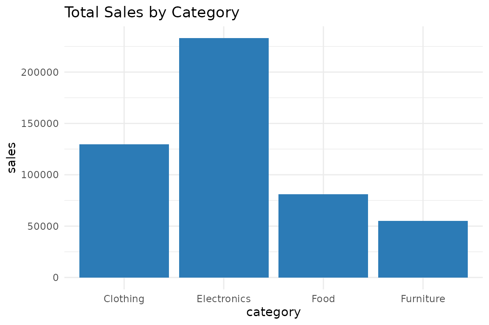

# Introduction to prestr

``` r
library(prestr)
```

## What is prestr?

`prestr` helps you turn data into PowerPoint presentations directly from
R. It provides three functions: summarize data, generate charts, and
export to `.pptx`, all in a few lines of code.

------------------------------------------------------------------------

## The Data

``` r
data(sales_data)
head(sales_data)
#>      month    category sales profit units_sold
#> 1  January Electronics 15200   4200        152
#> 2 February Electronics 13400   3800        134
#> 3    March Electronics 16800   4900        168
#> 4    April Electronics 14200   3900        142
#> 5      May Electronics 17500   5100        175
#> 6     June Electronics 19200   5800        192
```

------------------------------------------------------------------------

## Summarize

``` r
summarize_insights(sales_data)
#>       column  min   max     mean median
#> 1      sales 2900 28900 10395.83   8150
#> 2     profit  700  9100  2863.54   2050
#> 3 units_sold   58   815   291.27    263
```

------------------------------------------------------------------------

## Visualize

``` r
category_totals <- aggregate(sales ~ category, data = sales_data, FUN = sum)

auto_chart(category_totals, x = "category", y = "sales",
           chart_type = "bar", title = "Total Sales by Category")
```



------------------------------------------------------------------------

## Export to PowerPoint

``` r
create_ppt_report(
  data        = category_totals,
  title       = "Sales Report",
  subtitle    = "By Category",
  output_file = "sales_report.pptx"
)
```

The `.pptx` file is saved to your working directory, ready to open in
PowerPoint or Google Slides.
